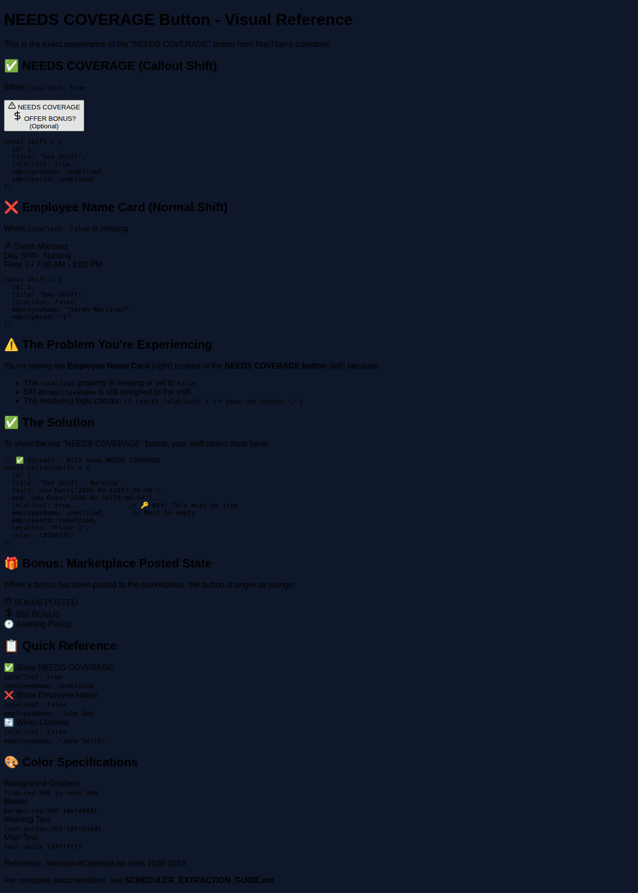

# Quick Start: Fixing "NEEDS COVERAGE" in NoxShift

## TL;DR - The Fix

Your shifts are showing employee names instead of "NEEDS COVERAGE" because you're missing the `isCallout` property.

### What You Need to Do

**1. Add this property to your shift type:**
```typescript
type Shift = {
  // ... your existing properties
  isCallout?: boolean;  // Add this line
}
```

**2. When someone calls out, set:**
```typescript
const openShift = {
  ...existingShift,
  isCallout: true,          // 🔑 This is the key
  employeeName: undefined,  // Remove employee
  employeeId: undefined
};
```

**3. Update your rendering logic:**
```typescript
{shift.isCallout ? (
  // Show red NEEDS COVERAGE button
  <button className="bg-red-900 border-red-500 animate-pulse">
    NEEDS COVERAGE
  </button>
) : (
  // Show employee name
  <div>{shift.employeeName}</div>
)}
```

That's it! 🎉

## Visual Reference

Open `NEEDS_COVERAGE_DEMO.html` in a browser to see the exact appearance.



## Complete Documentation

- **SCHEDULER_EXTRACTION_GUIDE.md** - Full implementation guide
- **NEEDS_COVERAGE_DEMO.html** - Interactive visual demo

## The Exact Button Code from NoxTitan

```tsx
<button
  className="w-full p-3 rounded-lg bg-gradient-to-br from-red-900 to-rose-900 border-2 border-red-500 text-white font-bold shadow-lg hover:from-red-800 hover:to-rose-800 transition-all hover:scale-105 cursor-pointer animate-pulse"
>
  <div className="flex flex-col items-center gap-1">
    <div className="flex items-center gap-1 text-yellow-300">
      <AlertTriangle className="w-4 h-4" />
      <span className="text-xs uppercase">NEEDS COVERAGE</span>
    </div>
    <div className="flex items-center gap-1 text-lg">
      <DollarSign className="w-5 h-5" />
      <span>OFFER BONUS?</span>
    </div>
    <div className="text-[8px] text-red-200 opacity-75">(Optional)</div>
  </div>
</button>
```

## Debugging Checklist

If it's still not working, check:
- [ ] `shift.isCallout === true` (not false, not undefined)
- [ ] `shift.employeeName === undefined` (not a string, not empty string)
- [ ] Your conditional: `if (shift.isCallout) { ... }`
- [ ] No typos: `isCallout` not `isCallOut` or `iscallout`

## Need Help?

See the full guide in `SCHEDULER_EXTRACTION_GUIDE.md` for:
- Complete step-by-step instructions
- Common mistakes and solutions
- Troubleshooting guide
- Color specifications
- Working code examples

---

**Reference**: `src/components/InteractiveCalendar.tsx` lines 1970-2034 in NoxTitan
